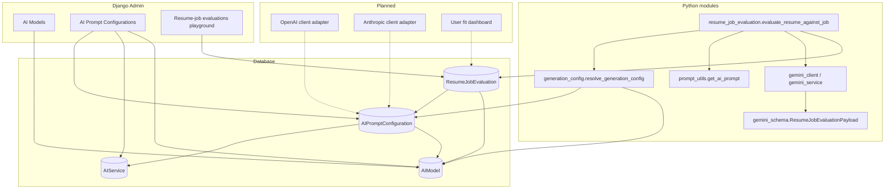
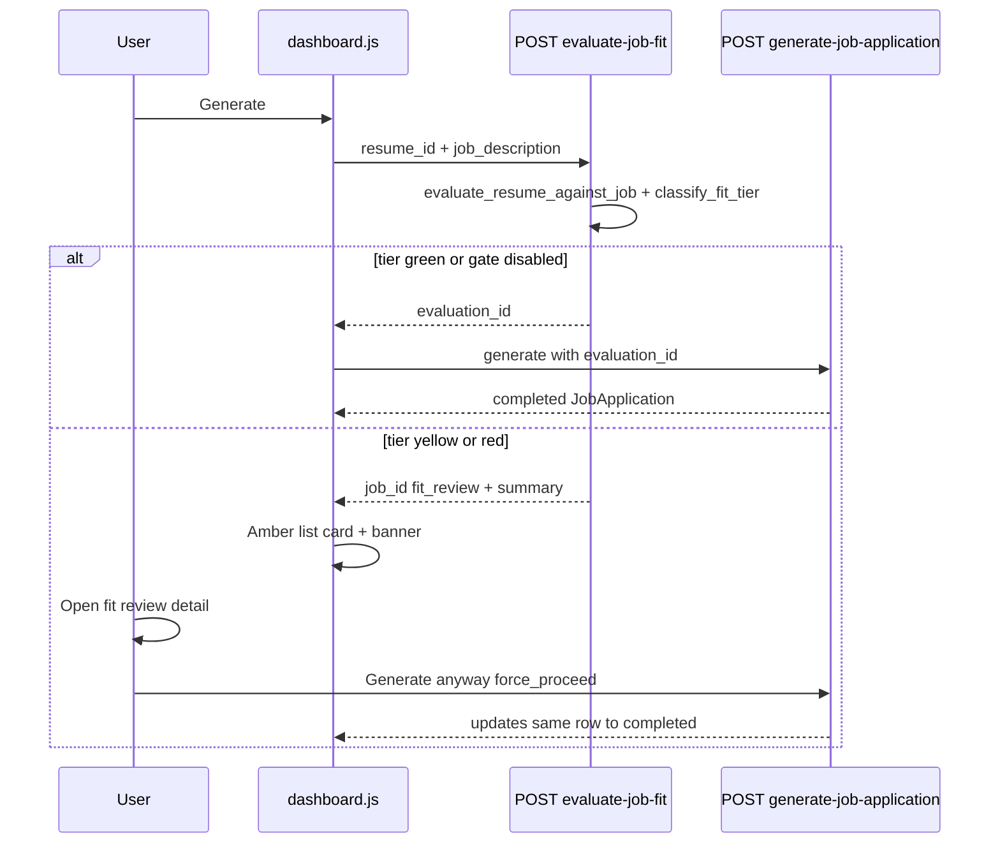
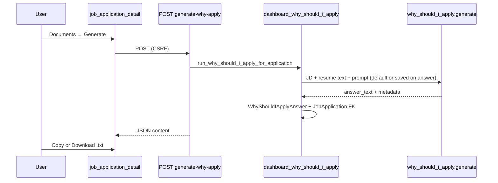

# Jobeas AI platform

This document describes how AI is organized in Jobeas today, where it is heading, and how features such as **resume–job evaluation** fit into the product.

For legacy OpenAI parsing/assistant notes, see [`../README.md`](../README.md). This file is the source of truth for **configurable prompts**, **model catalog**, and **structured Gemini outputs**.

---

## Table of contents

1. [Vision](#vision)
2. [Architecture overview](#architecture-overview)
3. [Data model](#data-model)
4. [Model and temperature resolution](#model-and-temperature-resolution)
5. [Multi-provider roadmap](#multi-provider-roadmap)
6. [Resume–job evaluation](#resumejob-evaluation)
7. [Structured output schema](#structured-output-schema)
8. [Product use cases (including dashboard)](#product-use-cases-including-dashboard)
9. [Admin and operations](#admin-and-operations)
10. [Adding a new AI task](#adding-a-new-ai-task)
11. [Configuration reference](#configuration-reference)
12. [Testing and calibration](#testing-and-calibration)

---

## Vision

**Goal:** Every AI capability in Jobeas should be driven from the database—not hardcoded prompts or model names in application code.

| Layer | Purpose | Today | Direction |
|-------|---------|-------|-----------|
| **AIService** | Named product capability (`cover_letter`, `resume_job_evaluation`, …) | Partially adopted | All new AI features register a service slug |
| **AIPromptConfiguration** | Versioned system prompts + default model/temperature per variant | Used for cover letter, optimization, evaluation | A/B prompts, strict vs pragmatic evaluators |
| **AIModel** | Catalog of provider + `model_id` (e.g. `gemini-2.5-pro`, `gpt-5.5`, `deepseek-v4-pro`) | Gemini, OpenAI, DeepSeek seeded; eval / summary / why-apply route by prompt FK | `resolve_for_prompt_config` |
| **Structured output** | Pydantic schemas validated before persist | `ResumeJobEvaluationPayload` (Gemini) | One schema module per structured task |
| **Run records** | Audit trail + user-facing history | `ResumeJobEvaluation`, `WhyShouldIApplyPlayground` (admin); `WhyShouldIApplyAnswer` (dashboard) | User-scoped runs linked to applications |

**Principle:** Code wires *how* to call AI (client, schema, persistence). Admins and seeds define *what* to say (prompt) and *which* model to use (catalog + prompt FK).

---

## Architecture overview



**Request flow (resume–job evaluation):**

1. Load `AIPromptConfiguration` for `AIService.slug = resume_job_evaluation` (or admin-selected variant).
2. `resolve_generation_config(prompt_config)` → `model_id`, `temperature`, `ai_model_id`.
3. Build user message from job description + resume plain text.
4. Call Gemini with `response_schema=ResumeJobEvaluationPayload`.
5. Pydantic-validate response; on success, persist to `ResumeJobEvaluation` (denormalized columns + full `evaluation_json`).

---

## Data model

### `AIService`

Represents a **product-level AI capability**.

| Field | Role |
|-------|------|
| `name` | Display name |
| `slug` | Stable code identifier (e.g. `resume_job_evaluation`, `cover_letter`) |
| `description` | What the service does |
| `is_active` | Soft kill switch |

**Convention:** Application code imports a constant slug (e.g. `RESUME_JOB_EVALUATION_SERVICE_SLUG`) and never magic-strings prompts in views.

### `AIPromptConfiguration`

A **versioned prompt variant** for one service.

| Field | Role |
|-------|------|
| `service` | FK → `AIService` |
| `name` / `slug` | Human name + code id (`v1-0`, `v1-1-strict`, …) |
| `system_prompt` | Full system instruction sent to the model |
| `ai_model` | FK → `AIModel` (default model for this variant) |
| `temperature` | Optional override (0–2) |
| `is_default` | One default per service (enforced on save) |
| `is_active` | Hide without deleting |

**Comparing models:** Duplicate the prompt row, change `ai_model` to `gemini-2.5-flash` vs `gemini-2.5-pro`, keep the same `system_prompt` to isolate model behavior.

**Comparing instructions:** Duplicate the row, change `slug` and `system_prompt` (see `eval_prompts.py` for source text to seed).

### `AIModel`

**Provider-agnostic model catalog.**

| Field | Role |
|-------|------|
| `provider` | `gemini` \| `openai` \| `deepseek` |
| `model_id` | Provider API id (`gemini-2.5-flash`, `gpt-5.5`, `gpt-4o`, `deepseek-v4-pro`, …) |
| `display_name` | Admin/UI label |
| `default_temperature` | Suggested default when prompt leaves temperature blank |
| `is_active` / `sort_order` | Admin dropdown ordering |

Seeded by:

```bash
python manage.py setup_ai_models
```

**Seeded catalogs (re-run safe via `update_or_create`):**

| Provider | Examples |
|----------|----------|
| **Gemini** | `gemini-2.5-flash-lite`, `gemini-2.5-flash`, `gemini-2.5-pro` |
| **OpenAI** | `gpt-5.5`, `gpt-5.4`, `gpt-5.4-mini`, `gpt-5.4-nano`, `gpt-5.2` … `gpt-5-nano`; legacy `gpt-4o`, `gpt-4o-mini`, `gpt-4o-2024-08-06`, `gpt-4` |
| **DeepSeek** | `deepseek-v4-pro`, `deepseek-v4-flash`; legacy `deepseek-chat`, `deepseek-reasoner` (deprecated 2026-07-24) |

### `ResumeJobEvaluation`

Persisted **evaluation run** (admin playground today; user-facing runs later).

| Field group | Fields |
|-------------|--------|
| **Labeling** | `name`, `description`, `conclusion` (conclusion auto-filled from `proceed_reasoning` on successful save) |
| **Inputs** | `job_description`, `resume_text`, `prompt_config` |
| **Run snapshot** | `ai_model`, `gemini_model`, `temperature_used`, `instruction_slug` |
| **Denormalized results** | `succeeded`, `recommendation`, `overall_score`, `optimization_potential`, `error_message` |
| **Full payload** | `evaluation_json`, `raw_response_text` |

Denormalized fields power list views and simple queries; `evaluation_json` is the canonical structured result for dashboards and APIs.

---

## Model and temperature resolution

Implemented in `ai_service/generation_config.py`.

**Precedence (highest wins):**

1. Per-run overrides (future user/API params; admin preview may add these later)
2. `AIPromptConfiguration.ai_model` + `temperature`
3. `AIModel.default_temperature`
4. Django settings / env fallbacks (`GEMINI_RESUME_JOB_EVAL_MODEL`, `GEMINI_RESUME_JOB_EVAL_TEMPERATURE`) — **optional**; omit in production when prompts are linked in admin

```python
from ai_service.generation_config import resolve_generation_config

gen = resolve_generation_config(prompt_config)
# gen.model_id, gen.temperature, gen.ai_model_id, gen.ai_model_display_name
```

**Important:** Resume–job evaluation currently **executes only through the Gemini client**. The catalog already stores OpenAI rows for other services; a future `ProviderRouter` will select `gemini_client` vs `openai_client` based on `AIModel.provider`.

---

## Multi-provider roadmap

### Today

| Provider | Catalog (`AIModel`) | Structured tasks | Prompt DB |
|----------|---------------------|------------------|-----------|
| **OpenAI** | Yes (catalog + DB prompts) | Resume parsing, cover letter, optimization, assistant; **professional summary**; **why-should-I-apply** (when prompt links OpenAI) | `setup_ai_prompts`, `setup_professional_summary`, `setup_why_should_i_apply` |
| **Google Gemini** | Yes | Resume–job evaluation, why-should-I-apply, professional summary (when prompt links Gemini) | `setup_resume_job_evaluation`, `setup_why_should_i_apply`, `setup_professional_summary` |
| **DeepSeek** | Yes (catalog + client) | **professional summary**; **why-should-I-apply** (when prompt links DeepSeek) | `setup_ai_models`; `DEEPSEEK_API_KEY` |

### Target shape

```text
evaluate_task(service_slug, prompt_slug, user_payload, *, ai_model_id=None)
    → prompt_config = load_prompt(service_slug, prompt_slug)
    → gen = resolve_generation_config(prompt_config, ai_model_id=...)
    → client = get_client_for_provider(prompt_config.ai_model.provider)
    → schema = SCHEMA_REGISTRY[service_slug]  # optional
    → return client.generate_structured(...) or client.generate_text(...)
```

**Adding Claude (example):**

1. Add `anthropic` to `AIModel.Provider`.
2. Implement `anthropic_client.py` with the same interface as `gemini_generate_structured_sync` where possible.
3. Seed models (`claude-sonnet-4-…`) via `setup_ai_models`.
4. Point a new or existing `AIPromptConfiguration` at that `AIModel`.

No change to `AIService` / prompt versioning model—only the execution layer branches by provider.

---

## Resume–job evaluation

### Purpose

**Pre-flight fit check** before resume optimization or cover letter generation: “Should this candidate pursue this role honestly, given only what is on the resume?”

- Impartial analyst; must not invent experience.
- Distinguishes **surface optimization** (wording, framing) from **foundational gaps** (wrong role family, missing hard requirements).

### Service identity

| Constant | Value |
|----------|--------|
| `RESUME_JOB_EVALUATION_SERVICE_SLUG` | `resume_job_evaluation` |
| Default prompt slug | `v1-0` |
| Instruction source | `ai_service/eval_prompts.py` → `EVALUATOR_INSTRUCTION_V1_0` (seeded into DB) |

### Code entry points

| Function | Module | Use |
|----------|--------|-----|
| `evaluate_resume_against_job(job_description, resume_text, prompt_config=…)` | `resume_job_evaluation.py` | Run provider from prompt AIModel + Pydantic validate |
| `persist_resume_job_evaluation_result(pk, result, …)` | `resume_job_evaluation.py` | Write DB after success |
| `parse_pending_evaluation_result(raw)` | `resume_job_evaluation.py` | Admin Save with hidden JSON |
| `conclusion_from_evaluation(eval_data)` | `resume_job_evaluation.py` | Extract `proceed_reasoning` for `conclusion` field |

### Bootstrap

```bash
python manage.py setup_ai_models
python manage.py setup_resume_job_evaluation
python manage.py setup_job_fit_gate
# optional: refresh system_prompt text
python manage.py setup_resume_job_evaluation --force
python manage.py setup_job_fit_gate --force
```

`entrypoint.sh` runs all three when `SKIP_BOOTSTRAP_DATA` is not set (deploy), then `check_ai_platform`.

### Recommendation labels

`Strong Fit` · `Good Fit` · `Moderate Fit` · `Weak Fit` · `Poor Fit`

**Calibration notes (from production testing):**

- **Poor Fit (~25):** Wrong role family (e.g. macOS endpoint engineer vs Python web resume)—trust this; do not mass-apply.
- **Weak Fit (~40):** Right lane, bar too high (senior + React when resume is mid-level Django)—stretch apply or target lower bar.
- **Strong Fit (~90+):** Rare near-perfect stack/seniority match.

Use the **same prompt slug** when comparing models; use **different prompt slugs** when comparing instruction versions.

---

## Structured output schema

Defined in `ai_service/gemini_schema.py` as **`ResumeJobEvaluationPayload`** (Pydantic).

Gemini receives this class as `response_schema`; the server **always re-validates** with Pydantic before treating a run as successful. Prompts must stay aligned with these fields (documented in `eval_prompts.py`).

### Top-level fields

| Field | Type | Meaning |
|-------|------|---------|
| `overall_score` | int 0–100 | Aggregate fit |
| `recommendation` | enum | Strong/Good/Moderate/Weak/Poor Fit |
| `optimization_potential` | int 0–100 | How much resume *wording* could help (not inventing skills) |
| `confidence` | High / Medium / Low | Confidence in the judgment (not “confidence you’ll get hired”) |
| `strengths` | string[] | Evidence-backed positives |
| `gaps` | string[] | Missing or weak areas |
| `hard_requirement_analysis` | object[] | Per-requirement breakdown |
| `transferable_skills` | object[] | Adjacent skills with evidence |
| `risk_level` | Low / Moderate / High | Hiring risk if proceeding |
| `dimension_summaries` | object | Narrative dimensions + `proceed_reasoning` |

### `hard_requirement_analysis[]`

| Field | Description |
|-------|-------------|
| `requirement` | Text from job posting |
| `match_status` | `met` \| `partially_met` \| `transferable` \| `missing` \| `unclear` \| `unrecoverable` |
| `evidence_quote` | Quote from resume (empty if none) |
| `notes` | Analyst notes |

### `dimension_summaries`

| Key | Focus |
|-----|--------|
| `core_competency_match` | Stack, tools, platforms |
| `seniority_match` | Years, ownership, level |
| `domain_match` | Industry / problem domain |
| `operational_experience_match` | Prod, on-call, CI/CD, reliability |
| `optimization_surface_vs_foundational_notes` | Wording vs real qualification gaps |
| `proceed_reasoning` | **Action summary** — copied to `ResumeJobEvaluation.conclusion` on persist |

### Example (minimal)

```json
{
  "overall_score": 72,
  "recommendation": "Moderate Fit",
  "optimization_potential": 65,
  "confidence": "Medium",
  "strengths": ["Production Django on GCP"],
  "gaps": ["No React listed"],
  "hard_requirement_analysis": [
    {
      "requirement": "2+ years Python backend",
      "match_status": "met",
      "evidence_quote": "TravelTAF Platform 2023-09 — Present",
      "notes": ""
    }
  ],
  "transferable_skills": [],
  "risk_level": "Moderate",
  "dimension_summaries": {
    "core_competency_match": "Strong Python web overlap.",
    "seniority_match": "",
    "domain_match": "",
    "operational_experience_match": "",
    "optimization_surface_vs_foundational_notes": "",
    "proceed_reasoning": "Worth a tailored apply if willing to ramp on React."
  }
}
```

---

## Product use cases (including dashboard)

The structured payload is designed so the **UI never has to parse free text**.

### Dashboard fit gate (implemented)

Before cover letter / resume optimization, the dashboard runs the **same** `evaluate_resume_against_job()` used in admin. Configuration is **not** env-driven: thresholds and production prompt come from **`JobFitGateSettings`** (singleton, admin) and prompt slug **`default-job-evaluation`** (seeded by `setup_job_fit_gate`).

**Resume text sent to Gemini** (parity with admin paste): `utils.resume_text.build_resume_text_for_evaluation(resume)` in `run_dashboard_job_fit_evaluation()`:

1. If `resume.pdf_file` is set → `extract_text_from_pdf` (same as upload/admin).
2. Else if `resume.original_content` (parsed upload text) → use as-is.
3. Else → `format_structured_resume_content()` from JSON, including `start_date` / `end_date` on experience and education.

This avoids under-reporting tenure when structured fields omit dates but the upload body contains them.

#### Two-phase Generate flow



| Endpoint | Purpose |
|----------|---------|
| `POST /dashboard/api/evaluate-job-fit/` | Phase 1: Gemini eval, tier, summary; creates `JobApplication` with `status=fit_review` when yellow/red |
| `POST /dashboard/api/generate-job-application/` | Phase 2: cover letter + optimize; requires `evaluation_id` when gate enabled; accepts `force_proceed` and `job_application_id` |

#### Tier rules (`ai_service/fit_gate.py`)

| Tier | Default rule | Generate behavior |
|------|----------------|-------------------|
| **green** | Score ≥ `green_min_score` (70) and Strong/Good Fit | Auto-proceed to phase 2 |
| **yellow** | Score 50–69 or Moderate/Weak Fit | No auto-generate; user proceeds from fit review detail |
| **red** | Score &lt; 50 or Poor Fit | Same as yellow; Poor Fit never auto-proceeds |
| **bypass** | `JobFitGateSettings.is_enabled` is false | Legacy single-step generate (no eval required) |

Stricter of score-based and recommendation-based tiers wins.

#### UI surfaces

| State | `JobApplication.status` | List card | Detail page |
|-------|-------------------------|-----------|-------------|
| **Fit review** | `fit_review` | Amber border; score · recommendation · opt. potential; **Review fit** | [`job_application_fit_review.html`](../dashboard/templates/dashboard/job_application_fit_review.html) — full summary, gaps/strengths, **Generate resume & cover letter** |
| **Completed** | `completed` | Green check; **score chip only** (if eval linked) | [`job_application_detail.html`](../dashboard/templates/dashboard/job_application_detail.html) — 3-metric hero, company/email/JD, **Documents** (resume, cover letter, **Why should we hire you?**) |
| **Completed** (no eval) | `completed` | Unchanged | Unchanged |

Display helpers: `evaluation_summary()` in `fit_gate.py`; orchestration in `dashboard_job_fit.py`; views in `dashboard/views.py`.

#### Models and seeds

| Artifact | Notes |
|----------|--------|
| `JobFitGateSettings` | `is_enabled`, `green_min_score`, `yellow_min_score`, `prompt_config` FK |
| `ResumeJobEvaluation.user` / `.resume` / `.job_application` | Audit trail for dashboard runs |
| `JobApplication.fit_evaluation` | Links application to eval row |
| `setup_job_fit_gate` | Seeds `default-job-evaluation` prompt + gate row |

#### Code entry points (dashboard)

| Function | Module |
|----------|--------|
| `run_dashboard_job_fit_evaluation()` | `dashboard_job_fit.py` |
| `create_fit_review_job_application()` | `dashboard_job_fit.py` |
| `validate_evaluation_for_generate()` | `dashboard_job_fit.py` |
| `classify_fit_tier()` | `fit_gate.py` |
| `evaluate_job_fit` / `generate_job_application` | `dashboard/views.py` |

See also [`docs/architecture/dashboard-job-application-pipeline.md`](../../docs/architecture/dashboard-job-application-pipeline.md).

### Why should I apply (implemented)

Generates a **plain application-field answer** to “Why should we hire you?” — not a cover letter (no greeting, no sign-off). Provider follows the prompt's linked **AIModel** (Gemini, OpenAI, or DeepSeek) via `resolve_for_prompt_config` in `why_should_i_apply.py`.

#### Flow (job application detail page)



| Endpoint | Purpose |
|----------|---------|
| `POST /dashboard/job-applications/<id>/generate-why-apply/` | Generate or regenerate answer (requires linked resume + job description) |
| `GET /dashboard/job-applications/<id>/download-why-apply/` | Download completed answer as `.txt` |

Copy uses the browser clipboard API on the detail page (no separate endpoint).

#### Models and seeds

| Artifact | Notes |
|----------|--------|
| `AIService.slug = why_should_i_apply` | Product capability |
| `AIPromptConfiguration.slug = v1-0` | Default prompt (`is_default=True`); version via slug |
| `WhyShouldIApplyPlayground` | Admin-only prompt testing (mirrors resume-job evaluations) |
| `WhyShouldIApplyAnswer` | User-facing persisted answer (`content`, `status`, prompt/model snapshots) |
| `JobApplication.why_should_i_apply_answer` | FK from dashboard application to answer row |
| `setup_why_should_i_apply` | Seeds service + v1-0 prompt (run after `setup_ai_models`) |
| `setup_professional_summary` | Seeds service + v1-0 OpenAI prompt for resume wizard summary |

#### Code entry points

| Function | Module |
|----------|--------|
| `generate_why_should_i_apply()` | `why_should_i_apply.py` |
| `run_why_should_i_apply_for_application()` | `dashboard_why_should_i_apply.py` |
| `generate_why_should_i_apply` / `download_why_should_i_apply` | `dashboard/views.py` |
| Instruction source | `why_should_i_apply_prompts.py` |

### Future dashboard ideas (not built)

| UI section | JSON source |
|------------|-------------|
| Requirements checklist | `hard_requirement_analysis` (filter `missing` / `partially_met`) |
| Stretch skills panel | `transferable_skills` |
| Apply-for-job automation | Phase 2 product |

### Other services (same platform pattern)

| Service slug (examples) | Output style | Schema home |
|-------------------------|--------------|-------------|
| `resume_job_evaluation` | Structured JSON | `gemini_schema.py` |
| `why_should_i_apply` | Plain text (application answer) | — |
| `cover_letter` | Text | — |
| `resume_optimization` | Text / JSON (legacy) | — |
| Future: `interview_prep` | Structured Q&A | TBD |

Each new structured task: add Pydantic model → document in prompt → seed `AIService` + `AIPromptConfiguration` → implement `*_service.py` runner → persist run row.

---

## Admin and operations

### Where to configure

| Task | Location |
|------|----------|
| Edit evaluator instructions | **AI Prompt Configurations** → service “Resume-to-Job Evaluation” |
| Change default model/temperature | Same row → `ai_model`, `temperature` |
| Add Gemini/OpenAI/DeepSeek catalog entries | **AI models** |
| Run manual eval tests | **Resume-job evaluations** (playground) — paste resume text **or upload PDF**; provider follows prompt's linked **AI model** |
| Run manual why-apply tests | **Why should I apply playground** — paste resume text **or upload PDF**; provider follows prompt's linked **AI model** (Gemini / OpenAI / DeepSeek) |
| Run manual summary tests | **Professional summary playground** — paste resume text **or upload PDF** |
| Resume wizard **Generate AI Summary** | `build_resume_text_for_summary` (same PDF → `original_content` → structured sources as job-fit; structured fallback omits existing summary); always default prompt |
| Tune dashboard gate thresholds / production prompt | **Job fit gate settings** (singleton) |
| Edit why-apply instructions | **AI Prompt Configurations** → service “Why Should I Apply” |

**Deploy verification:** `entrypoint.sh` runs `setup_ai_models`, `setup_resume_job_evaluation`, `setup_job_fit_gate`, `setup_why_should_i_apply`, `setup_professional_summary`, then `check_ai_platform`. Admin header shows `AI platform <build>`. Under **AI SERVICE**: **AI models**, **AI Prompt Configurations**, **Job fit gate settings**, **Resume-job evaluations**, **Why should I apply playground**, **Professional summary playground**.

### Playground workflow

1. Set **Name** / **Description** so list rows are identifiable.
2. Paste job description; add resume via **Resume text** and/or **Resume PDF** (same extractor as dashboard upload — `utils.pdf_text.extract_text_from_pdf`).
3. **Load PDF into resume text** (optional preview) or attach PDF when clicking **Get evaluation** / **Get answer**.
4. Choose prompt config → **Get evaluation** (AJAX; no save required).
5. **Save** — persists inputs + last successful preview; fills **Conclusion** from `proceed_reasoning`.

List columns: name, recommendation, score, model, truncated description/conclusion, succeeded, created_at.

### Labeling test runs (examples)

| Name | Description |
|------|-------------|
| `Northbridge Senior — Pro` | Test resume v1 vs fictional senior Django/React JD; gemini-2.5-pro |
| `Harborline Mid — Pro` | Tailored mid-level Django/GCP match test |

---

## Adding a new AI task

Checklist for a **new structured Gemini task** (adjust for OpenAI-only tasks):

1. **Define schema** — Add Pydantic model to `gemini_schema.py` (or a dedicated `*_schema.py`).
2. **Write instruction** — Module like `eval_prompts.py` with versioned constants.
3. **Register service** — `AIService` row + management command `setup_*`.
4. **Seed prompt** — `AIPromptConfiguration` with `system_prompt`, `ai_model`, `temperature`, `slug`.
5. **Implement runner** — `evaluate_*` function: resolve config → call client → validate → return dict.
6. **Persist** — Model for audit/history (optional user FK).
7. **Admin** — Playground or inline if internal-only.
8. **Tests** — Schema validation + persist path (see `ai_service/tests.py`).

For **multi-provider tasks** (eval, why-apply, professional summary), use `resolve_for_prompt_config()` and branch on `AIModel.provider` (see `resume_job_evaluation.py`, `why_should_i_apply.py`, `professional_summary.py`). Legacy OpenAI text tasks may still use `prompt_utils.py` + `open_ai.py`.

---

## Configuration reference

### Environment variables

**Production:** set API keys for whichever providers your default prompts use (`GEMINI_API_KEY` / `GOOGLE_API_KEY`, `OPENAI_API_KEY`, `DEEPSEEK_API_KEY`). Model and temperature come from admin **AI Prompt Configurations** and **Job fit gate settings** (production eval prompt), not from env overrides.

| Variable | Required? | Purpose |
|----------|-----------|---------|
| `GEMINI_API_KEY` or `GOOGLE_API_KEY` | **Yes** (one) | Gemini API authentication |
| `OPENAI_API_KEY` | For OpenAI features | Resume parsing, cover letter, optimization, assistant, AI summary |
| `DEEPSEEK_API_KEY` | For future DeepSeek client | Catalog seeded; not wired in application code yet |
| `GEMINI_RESUME_JOB_EVAL_MODEL` | No | Code fallback if prompt has no `ai_model` linked |
| `GEMINI_RESUME_JOB_EVAL_TEMPERATURE` | No | Code fallback if prompt/model leave temperature unset |

Change evaluation model or temperature in **AI Prompt Configurations** (and **AI models**) without redeploying.

See `.env.example`.

### Key modules

| Module | Responsibility |
|--------|----------------|
| `models.py` | `AIService`, `AIPromptConfiguration`, `AIModel`, `JobFitGateSettings`, `ResumeJobEvaluation`, `WhyShouldIApplyPlayground`, `WhyShouldIApplyAnswer` |
| `fit_gate.py` | Tier classification + `evaluation_summary()` for UI |
| `job_fit_settings.py` | Singleton gate settings loader |
| `dashboard_job_fit.py` | Dashboard adapter around shared evaluator |
| `generation_config.py` | Model/temperature resolution |
| `prompt_utils.py` | Load prompt text by service slug |
| `eval_prompts.py` | Versioned evaluator instructions (source for seeds) |
| `gemini_schema.py` | Pydantic schemas for Gemini structured output |
| `gemini_client.py` | Low-level sync Gemini calls |
| `gemini_service.py` | Higher-level Gemini helpers |
| `resume_job_evaluation.py` | Job-fit evaluation (Gemini structured / OpenAI & DeepSeek JSON) + persist |
| `admin_resume_pdf.py` | Admin PDF upload → `extract_text_from_pdf` for playgrounds |
| `utils/pdf_text.py` | Shared PDF text extraction (pdfplumber, PyPDF2 fallback) |
| `utils/resume_text.py` | `build_resume_text_for_evaluation()` (dashboard eval); `build_resume_text_for_summary()` (wizard summary) |
| `professional_summary.py` | OpenAI summary generation + admin playground persist |
| `professional_summary_prompts.py` | Versioned summary instructions (seed source) |
| `why_should_i_apply.py` | Why-apply plain-text generation (Gemini / OpenAI / DeepSeek via `resolve_for_prompt_config`) |
| `why_should_i_apply_prompts.py` | Versioned why-apply instructions (source for seeds) |
| `dashboard_why_should_i_apply.py` | Dashboard adapter for job application detail |
| `admin.py` | Admin UX for models, prompts, playgrounds |

---

## Testing and calibration

```bash
python manage.py test ai_service.tests.ResumeJobEvaluationSchemaTests
python manage.py test ai_service.tests.ResumeJobEvaluationPersistOnSaveTests
python manage.py test ai_service.tests.GenerationConfigResolverTests
python manage.py test ai_service.tests.ConclusionFromEvaluationTests
python manage.py test ai_service.tests.FitGateTests
python manage.py test ai_service.tests.WhyShouldIApplyPromptTests
python manage.py test ai_service.tests.WhyShouldIApplyGenerationTests
python manage.py test ai_service.tests.WhyShouldIApplyPlaygroundPersistTests
python manage.py test dashboard.tests.WhyShouldIApplyDocumentTests
python manage.py test dashboard.tests
```

**Model calibration workflow:**

1. Fix resume text and job description.
2. Duplicate prompt config with different `ai_model` rows OR change only `system_prompt` slug.
3. Label runs with **Name** / **Description** / review **Conclusion**.
4. Compare scores only within the same `instruction_slug`; compare models only with the same prompt text.

**Known behavior:**

- `gemini-2.5-pro` is stricter on role-family mismatch than `gemini-2.5-flash`.
- `gemini-2.5-flash-lite` tends toward optimistic triage—use for cheap first pass, not final gate.

---

## Related documentation

- [`../README.md`](../README.md) — Resume parsing (RISEN), OpenAI assistant, legacy flows
- [`../eval_prompts.py`](../eval_prompts.py) — Evaluator instruction v1.0 source text
- [`../gemini_schema.py`](../gemini_schema.py) — Payload types and literals

---

*Last updated: 2026-05-22 — why-should-I-apply service (`why_should_i_apply`), admin playground, dashboard Documents generate/copy/download, `WhyShouldIApplyAnswer`, migrations `ai_service/0006`–`0007`, `dashboard/0008`.*
