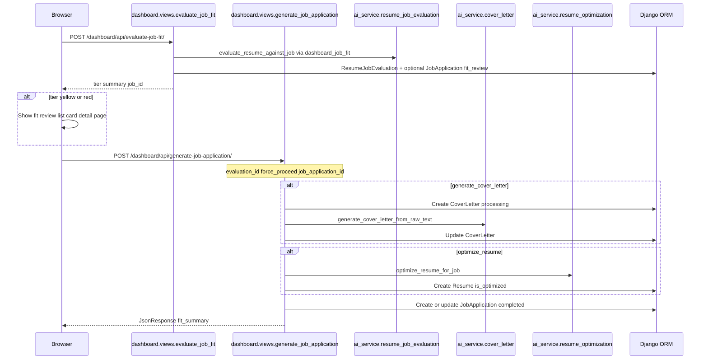
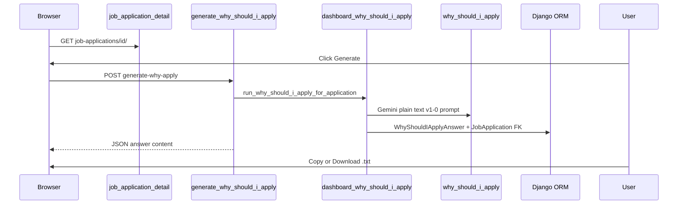

# Dashboard job application and resume optimization pipeline

| Field | Value |
|--------|--------|
| **Document ID** | `ARCH-DASH-JA-001` |
| **Short reference** | “JA pipeline doc” / `ARCH-DASH-JA-001` |
| **Scope** | Dashboard “Generate” flow: optional Gemini fit gate, optional cover letter + optional resume optimization + `JobApplication` record; **why-should-we-hire-you** answer on application detail (on-demand) |
| **Audience** | Engineers extending orchestration, AI prompts, or persistence for job applications |

This document is the **canonical map** for this feature set. For deeper product intent and bug-fix backlog, see the tracked plan in-repo (historically: job-gen false-positive / join-hardening work).

---

## 1. Purpose

Describe **where business logic lives** and how requests move through **Django views**, **AI services**, and **persistence**, so future work can cite a **stable document ID** instead of ad-hoc chat.

---

## 2. High-level design (HLD)

### 2.1 Context

- **Actor**: Authenticated user on the **dashboard**.
- **Goal**: From one job description (and selected resume), optionally generate a **cover letter**, optionally create an **optimized copy** of the resume, and record a **job application** linking artifacts. On the **application detail** page, optionally generate a **“Why should we hire you?”** application answer (plain text, not a cover letter).
- **External systems**: **OpenAI** (cover letter, resume optimization via `ai_service`); **Google Gemini** (job-fit evaluation and why-apply answer).

### 2.2 Logical components

| Component | Responsibility |
|-----------|----------------|
| **Dashboard orchestration** | Validates input, sequencing, creates/updates `CoverLetter`, calls optimization helper, creates `JobApplication`, returns JSON |
| **Cover letter AI** | Builds chat completion from job text + resume text; parses structured sections |
| **Resume optimization AI** | Builds chat completion from job + structured resume snapshot; parses `TITLE` / optional `EMAIL_SUBJECT` / `OPTIMIZATION` JSON |
| **Persistence** | `Resume`, `CoverLetter`, `JobApplication`, `WhyShouldIApplyAnswer` models |
| **Standalone cover letter UI** | Alternate entry point (not dashboard) with different resume-text construction |

### 2.3 Primary request flow (dashboard)

When **job fit gate** is enabled (`JobFitGateSettings.is_enabled`), generation is **two-phase**: evaluate first, then generate only if tier is green or user overrides from the fit review detail page.

If gate is **disabled**, the browser skips the evaluate call’s blocking behavior and may call generate directly (bypass tier).

### 2.4 Why-should-we-hire-you (application detail)

Separate from the main **Generate** checkbox flow. After a job application is **completed**, the user opens the detail page and generates an answer from **Documents → Why should we hire you?**

Requires `JobApplication.resume` and non-empty `job_description`. Not available on `fit_review` status rows.

---

## 3. Low-level implementation map (LLD pointer)

This section ties **HLD components** to **modules and entry points** (file paths relative to repository root).

### 3.1 Orchestration and resume snapshot formatting

| Artifact | Module | Key symbols |
|----------|--------|-------------|
| HTTP API | [`dashboard/views.py`](../../dashboard/views.py) | `generate_job_application`, `get_unified_job_applications` |
| Resume → text for **job-fit eval** | [`utils/resume_text.py`](../../utils/resume_text.py) | `build_resume_text_for_evaluation` (PDF → `original_content` → structured + dates); used by [`dashboard_job_fit.py`](../../dashboard/dashboard_job_fit.py) |
| Resume → text for cover letter / optimize | [`dashboard/views.py`](../../dashboard/views.py) | `_format_resume_content` |
| PDF text extraction (upload + admin) | [`utils/pdf_text.py`](../../utils/pdf_text.py) | `extract_text_from_pdf` |
| Build optimized `Resume` row | [`dashboard/views.py`](../../dashboard/views.py) | `_optimize_resume_for_job_application` |

### 3.2 AI services

| Concern | Module | Key symbols |
|---------|--------|-------------|
| Cover letter generation | [`ai_service/cover_letter.py`](../../ai_service/cover_letter.py) | `generate_cover_letter_from_raw_text`, `parse_ai_response`, `clean_cover_letter_content` |
| Resume optimization | [`ai_service/resume_optimization.py`](../../ai_service/resume_optimization.py) | `optimize_resume_for_job`, `parse_ai_response`, `parse_optimization_data` |
| Job fit evaluation | [`ai_service/resume_job_evaluation.py`](../../ai_service/resume_job_evaluation.py) | `evaluate_resume_against_job` (provider from gate / prompt AIModel: Gemini / OpenAI / DeepSeek) |
| Why-should-I-apply | [`ai_service/why_should_i_apply.py`](../../ai_service/why_should_i_apply.py) | `generate_why_should_i_apply` (provider from prompt's AIModel: Gemini / OpenAI / DeepSeek) |
| Dashboard why-apply adapter | [`ai_service/dashboard_why_should_i_apply.py`](../../ai_service/dashboard_why_should_i_apply.py) | `run_why_should_i_apply_for_application` |
| Shared / related helpers | [`ai_service/open_ai.py`](../../ai_service/open_ai.py), [`ai_service/structured_resume.py`](../../ai_service/structured_resume.py) | Client, structured extraction (used elsewhere in product) |

### 3.3 Standalone cover letter (non-dashboard)

| Artifact | Module | Notes |
|----------|--------|--------|
| Form + POST handler | [`coverletter/views.py`](../../coverletter/views.py) | `job_cover_letter` builds `resume_text` differently than `_format_resume_content` |

### 3.4 Data models

| Model | Module |
|-------|--------|
| `JobApplication` | [`dashboard/models.py`](../../dashboard/models.py) — statuses: `processing`, `fit_review`, `completed`, `failed`; `fit_evaluation` FK; `why_should_i_apply_answer` FK |
| `WhyShouldIApplyAnswer` | [`ai_service/models.py`](../../ai_service/models.py) — user-facing answer artifact (`content`, `status`, prompt/model snapshots) |
| `Resume` | [`resume_builder/models.py`](../../resume_builder/models.py) |
| `CoverLetter` | [`coverletter/models.py`](../../coverletter/models.py) |

### 3.5 Application hub (manual job application)

| Concern | Location |
|---------|----------|
| Detail page — completed | [`job_application_detail.html`](../../dashboard/templates/dashboard/job_application_detail.html) — fit metrics hero, company/email/JD, **Documents** (resume, cover letter, why-apply with Generate / Copy / Download) |
| Detail page — fit review | [`job_application_fit_review.html`](../../dashboard/templates/dashboard/job_application_fit_review.html) — full eval + generate CTA |
| Shared fit hero partial | [`dashboard/templates/dashboard/partials/fit_summary_hero.html`](../../dashboard/templates/dashboard/partials/fit_summary_hero.html) |
| Route | [`dashboard/urls.py`](../../dashboard/urls.py) `job-applications/<id>/`, `generate-why-apply/`, `download-why-apply/` |
| List “Open” (dashboard rows) | [`job_service/templates/job_service/my_applications.html`](../../job_service/templates/job_service/my_applications.html) → detail URL |
| Outbound email log | [`email_utility.models.EmailHistory`](../../email_utility/models.py) with `attachment_type=job_application` and `attachment_id` = dashboard `JobApplication.id`; successful send also updates `JobApplication.company_email` in [`email_utility/views.py`](../../email_utility/views.py) `send_email` |
| Manual vs automatic | [`dashboard.models.JobApplication.application_kind`](../../dashboard/models.py) (`manual` default; `automatic` reserved for platform flows) |

Unified **My Job Applications** still merges dashboard `JobApplication` rows (`source: dashboard`) with `JobApplicationRequest` (`source: job_service_request`); only dashboard rows use this detail view in the MVP.

### 3.6 Frontend trigger (not domain logic)

| Artifact | Path |
|----------|------|
| POST evaluate + generate + list cards | [`dashboard/static/dashboard/dashboard.js`](../../dashboard/static/dashboard/dashboard.js) |
| Routes | [`dashboard/urls.py`](../../dashboard/urls.py) → `api/evaluate-job-fit/`, `api/generate-job-application/` |
| List item partial | [`dashboard/templates/dashboard/partials/job_application_item.html`](../../dashboard/templates/dashboard/partials/job_application_item.html) — amber `fit_review`, score chip on `completed` |

### 3.7 Resume rendering (presentation)

| Concern | Module |
|---------|--------|
| HTML template choice | `resume_templates/<template_id>.html` |
| Registry / valid IDs | [`resume_builder/template_registry.py`](../../resume_builder/template_registry.py) |
| Render helper | [`resume_builder/views.py`](../../resume_builder/views.py) `_render_resume_template_html` |

---

## 4. Design notes (behavioral contract, summary)

- **Templates** share one structured JSON **resume model**; `template_id` selects layout. Optimization **copies** `template_id` from the source resume when creating an optimized row (see `_optimize_resume_for_job_application`).
- **Optimization scope** implemented in `_optimize_resume_for_job_application` is **not** identical to the full list of fields the AI prompt may discuss; **experience** on the new `Resume` is populated from the **source** `experience` unless product code is extended to merge AI-produced experience into `experience` (or templates are changed to read `relevant_experience`).
- **Standalone vs dashboard** cover-letter paths may use **different** resume serialization; behavior and failure modes can differ.

---

## 5. How to cite this document

- **In PRs / tickets**: `ARCH-DASH-JA-001` or `docs/architecture/dashboard-job-application-pipeline.md`
- **In code comments** (optional): `See ARCH-DASH-JA-001`

---

## 6. Related documentation

- [`docs/INTERNAL_TECHNICAL_OVERVIEW.md`](../INTERNAL_TECHNICAL_OVERVIEW.md) — wider product technical overview (if aligned with current tree)
