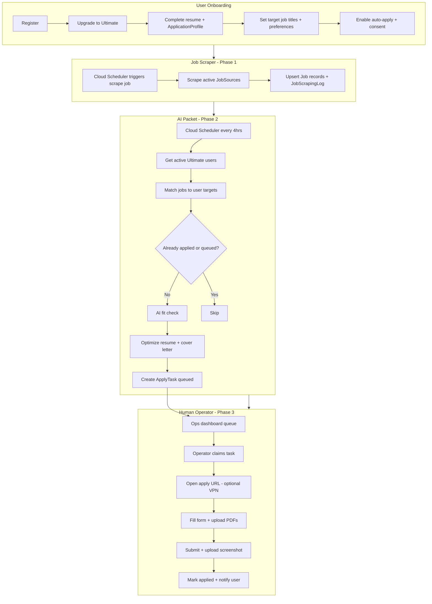
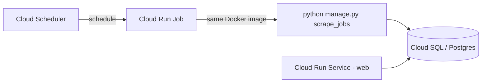

# Ultimate Auto-Apply & Job Scraper — Implementation Plan

| Field | Value |
|--------|--------|
| **Document ID** | `ARCH-ULTIMATE-AUTO-001` |
| **Scope** | Job scraping (Phase 1), Ultimate AI apply-packet generation (Phase 2), human-in-the-loop form submission (Phase 3), optional browser automation later (Phase 4+) |
| **Audience** | Engineers, product, and ops implementing scraper infrastructure, GCP scheduling, Ultimate automation, and the operator queue |

This document is the canonical plan for building **job ingestion**, **AI-prepared apply packets**, and **managed applications** (human operators submit forms on behalf of Ultimate users).

**Apply strategy (v1):** AI does matching, resume optimization, and cover letters; **human operators** fill employer web forms and submit. Full browser automation is deferred to a later phase.

---

## 1. Product summary

**Ultimate plan users** opt in to a **managed apply service**:

1. User registers and upgrades to **Ultimate**.
2. User completes resume, **application profile** (contact, work auth, LinkedIn, etc.), sets **target job titles**, location/remote preferences, and enables auto-apply with **explicit consent**.
3. A **job scraper** populates the `Job` table from external sources (Phase 1 — implemented).
4. Every **4 hours**, a worker finds Ultimate users, matches scraped jobs to their target titles, runs AI fit check, optimizes resume, and generates a cover letter.
5. Each match becomes an **`ApplyTask`** in the **operator queue** — a human opens the apply URL, fills the form, uploads documents, and submits.
6. Operator marks the task **applied** (with screenshot proof); user receives a digest notification.

**Who qualifies:** users with an active `subscriptions.UserSubscription` where `plan.name == 'Ultimate'` and `status == 'ACTIVE'`.

### Why human-in-the-loop first

| Full browser automation | Human-in-the-loop (v1) |
|-------------------------|-------------------------|
| Breaks on every ATS change | Operators adapt to any form |
| CAPTCHA blocks bots | Human solves CAPTCHA |
| Months to build per-ATS adapters | Ops queue shippable in weeks |
| ~60–80% success on easy ATS | ~95%+ with trained operators |
| High engineering cost | Higher ops cost, predictable quality |

Automate submission (email, Playwright) only **after** the queue is running and you know which ATS patterns are worth automating.

---

## 2. Where code lives (app placement)

### Phase 1 — Job scraper → `job_service` (no new app)

Models already exist in `job_service`:

| Model | Purpose |
|-------|---------|
| `JobSource` | Websites, APIs, RSS feeds to scrape |
| `Job` | Normalized job postings |
| `JobScrapingLog` | Per-run scrape history |

Proposed file structure:

```
job_service/
  scrapers/
    base.py           # BaseScraper interface
    greenhouse.py     # First real source (API)
    lever.py          # Second source
    registry.py       # source_type → scraper class
  services/
    ingestion.py      # normalize, dedup, upsert Job rows
  management/commands/
    scrape_jobs.py    # CLI entry point
```

### Phase 2 — AI apply packet → new `automation` app

Match users, run AI pipeline, create `ApplyTask` rows (no submission yet):

```
automation/
  models.py                    # ApplyTask, ApplicationProfile
  services/
    application_builder.py     # fit gate → cover letter → resume optimize
    job_matcher.py             # match jobs to Ultimate user preferences
    apply_packet.py            # assemble operator-facing packet
  management/commands/
    run_ultimate_auto_apply.py # cron: match + AI + queue tasks
```

### Phase 3 — Human operator queue → `automation` app

Staff dashboard for claiming tasks and recording submissions:

```
automation/
  views/
    ops_queue.py               # list / claim / complete / skip tasks
  templates/automation/ops/    # operator UI
  permissions.py               # Operator group, not full admin
```

### Phase 4+ — Optional automated submission (later)

Only after human queue is stable:

```
automation/
  adapters/
    base.py
    email_adapter.py
    greenhouse_adapter.py      # Playwright
    playwright_adapter.py
  services/
    application_submitter.py   # try bot first → fallback to human queue
```

| Phase | App | Responsibility |
|-------|-----|----------------|
| **1** | `job_service` | Scrape → write `Job` ✅ |
| **2** | `automation` | Ultimate users → match → AI packet → `ApplyTask` |
| **3** | `automation` | Operator queue UI + human submit + proof |
| **4+** | `automation` | Email/Playwright adapters to reduce human load |

---

## 3. End-to-end workflow (human-in-the-loop)



### Division of labor

| Step | Who |
|------|-----|
| Scrape jobs | Cron / Cloud Run Job |
| Match to user title/prefs | Rules + optional AI |
| Fit gate (skip bad matches) | AI |
| Resume optimize | AI |
| Cover letter + short answers | AI |
| Open apply URL | **Human operator** |
| Fill form fields | **Human operator** |
| CAPTCHA / login / multi-step forms | **Human operator** |
| Upload resume / cover letter PDFs | **Human operator** |
| Submit application | **Human operator** |
| Record proof + notify user | **Human operator** (via ops UI) |

Typical operator time: **2–5 minutes per application** with a complete apply packet.

---

## 4. Ultimate user requirements

Before automation runs, each Ultimate user must have:

| Requirement | Model / location | Status |
|-------------|------------------|--------|
| Active Ultimate plan | `subscriptions.UserSubscription` | Exists |
| At least one resume | `resume_builder.Resume` | Exists |
| **Application profile** (phone, address, LinkedIn, work auth) | **New `ApplicationProfile`** | Missing |
| Target job title(s) | **New field needed** | Missing |
| Auto-apply opt-in | **New field needed** | Missing |
| Default resume for automation | **New field needed** | Missing |
| Location / remote / salary prefs | `UserJobPreferences` | Exists |
| Explicit consent (authorize apply on user's behalf) | **New field or UI step** | Missing |

### New fields to add (Phase 2)

**Canonical model:** `automation.UltimateAutomationProfile` (created on Ultimate setup).

```python
primary_titles = models.JSONField(default=list)
# Core roles, e.g. ["Backend Engineer", "Software Engineer"]

related_titles = models.JSONField(default=list)
# Adjacent synonyms for Stage 2, e.g. ["Platform Engineer", "SWE"]

exclude_titles = models.JSONField(default=list)
# Never match, e.g. ["Data Scientist", "Engineering Manager"]

auto_apply_enabled = models.BooleanField(default=False)
default_resume = models.ForeignKey('resume_builder.Resume', ...)
title_family_confirmed = models.BooleanField(default=False)
max_applications_per_day = models.IntegerField(default=10)
```

**Stage 2 matching uses `title_family` = primary + related only.** Skills are not used to admit jobs (Stage 3 AI fit owns skills / JD). `exclude_titles` is a hard reject.

**Ultimate onboarding:** after checkout success → `/automation/ultimate/setup/`  
- Suggest titles from resume via AI (`suggest_title_family`)  
- User edits and confirms before `auto_apply_enabled`

### ApplicationProfile (Phase 2 — for operator form fill)

Web apply forms require more than a resume. Store once per user:

```python
class ApplicationProfile(models.Model):
    user = models.OneToOneField(User, on_delete=models.CASCADE)
    legal_first_name = models.CharField(max_length=100)
    legal_last_name = models.CharField(max_length=100)
    phone = models.CharField(max_length=20)
    email = models.EmailField()  # may differ from login email
    address_line1 = models.CharField(max_length=200, blank=True)
    city = models.CharField(max_length=100, blank=True)
    state_province = models.CharField(max_length=100, blank=True)
    postal_code = models.CharField(max_length=20, blank=True)
    country = models.CharField(max_length=100, blank=True)
    linkedin_url = models.URLField(blank=True)
    portfolio_url = models.URLField(blank=True)
    work_authorization = models.CharField(max_length=50)  # e.g. us_citizen, h1b, etc.
    requires_sponsorship = models.BooleanField(default=False)
    desired_salary_min = models.DecimalField(null=True, blank=True, ...)
    desired_salary_max = models.DecimalField(null=True, blank=True, ...)
    hear_about_us_default = models.CharField(max_length=100, default='Job board')
    eeo_opt_in = models.BooleanField(default=False)  # only fill EEO if user opts in
    apply_via_vpn_region = models.CharField(max_length=50, blank=True)  # e.g. US-CA
    consent_to_apply_on_behalf = models.BooleanField(default=False)
    consent_signed_at = models.DateTimeField(null=True, blank=True)
```

### ApplyTask (Phase 2–3 — operator queue)

```python
class ApplyTask(models.Model):
    user = models.ForeignKey(User, on_delete=models.CASCADE)
    job = models.ForeignKey('job_service.Job', on_delete=models.CASCADE)
    resume = models.ForeignKey('resume_builder.Resume', null=True)  # optimized copy
    cover_letter_text = models.TextField(blank=True)
    cover_letter_pdf = models.FileField(upload_to='apply_packets/', blank=True)
    resume_pdf = models.FileField(upload_to='apply_packets/', blank=True)
    ai_short_answers = models.JSONField(default=dict)  # e.g. {"why_company": "..."}

    status = models.CharField(max_length=20, choices=[
        ('queued', 'Queued'),
        ('claimed', 'Claimed'),
        ('applied', 'Applied'),
        ('failed', 'Failed'),
        ('skipped', 'Skipped'),
    ], default='queued')

    priority = models.PositiveSmallIntegerField(default=0)
    assigned_to = models.ForeignKey(User, null=True, blank=True, related_name='claimed_apply_tasks')
    claimed_at = models.DateTimeField(null=True, blank=True)
    applied_at = models.DateTimeField(null=True, blank=True)

    confirmation_url = models.URLField(max_length=500, blank=True)
    proof_screenshot = models.FileField(upload_to='apply_proofs/', blank=True)
    operator_notes = models.TextField(blank=True)
    skip_reason = models.CharField(max_length=50, blank=True)  # captcha, login_required, job_closed, geo_block
    failure_reason = models.TextField(blank=True)

    created_at = models.DateTimeField(auto_now_add=True)
    updated_at = models.DateTimeField(auto_now=True)

    class Meta:
        unique_together = ['user', 'job']
        indexes = [
            models.Index(fields=['status', 'priority', 'created_at']),
        ]
```

On **applied**, also create `job_service.JobApplication` and notify the user.

### Ultimate subscription check

```python
from subscriptions.models import UserSubscription

def is_ultimate_subscriber(user):
    sub = UserSubscription.objects.filter(
        user=user,
        plan__name__iexact='Ultimate',
        status='ACTIVE',
    ).select_related('plan').first()
    return sub is not None and sub.is_active
```

---

## 5. Job matching logic

```python
def job_matches_user(job, user_prefs):
    title_lower = job.title.lower()

    # Title match: any target title appears in job title
    title_match = any(
        target.lower() in title_lower
        for target in user_prefs.target_job_titles
    )
    if not title_match:
        return False

    # Optional: location filter
    if user_prefs.preferred_locations:
        if not any(loc.lower() in job.location.lower()
                   for loc in user_prefs.preferred_locations):
            return False

    # Optional: remote preference
    if user_prefs.remote_preference == 'remote_only':
        if 'remote' not in job.location.lower():
            return False

    return True
```

Skip jobs already applied to (`job_service.JobApplication` has `unique_together = ['user', 'job']`).

Enforce daily cap per user:

```python
applications_today = JobApplication.objects.filter(
    user=user,
    applied_at__date=today,
).count()

if applications_today >= user_prefs.max_applications_per_day:
    continue  # skip this user for this run
```

---

## 6. AI pipeline (reuse existing dashboard logic)

Extract from `dashboard/views.py` (`evaluate_job_fit`, `generate_job_application`) into `automation/services/application_builder.py`.

| Step | Existing service | Action |
|------|------------------|--------|
| Fit check | `ai_service.fit_gate` | Skip weak matches (optional) |
| Resume optimize | `ai_service.resume_optimization` | Create optimized `Resume` copy + PDF |
| Cover letter | `ai_service.cover_letter` | Generate text + optional PDF |
| Short answers | `ai_service` (new or why-apply) | Draft "Why this company?" etc. |
| Queue task | `automation.ApplyTask` | Status `queued` — **no auto-submit** |
| After human applies | `job_service.JobApplication` | Status `applied` + proof on `ApplyTask` |

See also: `docs/architecture/dashboard-job-application-pipeline.md` (`ARCH-DASH-JA-001`).

---

## 6b. Operator workflow (Phase 3)

### Apply packet contents

Each `ApplyTask` exposes one page for operators with:

- Job title, company, location, `application_url` (open in new tab)
- User `ApplicationProfile` (copy-paste fields)
- Optimized resume PDF + cover letter (text + PDF)
- AI-generated short answers for common free-text questions
- Checklist: work auth, sponsorship, salary range, VPN region if set

### Ops dashboard (wireframe)

```
┌─────────────────────────────────────────────────────────┐
│ Apply Queue (12 pending)                                │
├─────────────────────────────────────────────────────────┤
│ [P1] Jane D. → Senior Python Dev @ Stripe               │
│      URL: boards.greenhouse.io/...  |  Due: 2h          │
│      [Open packet] [Claim] [Mark applied] [Skip]        │
├─────────────────────────────────────────────────────────┤
│ [P2] John S. → Backend Engineer @ Datadog               │
│      ...                                                │
└─────────────────────────────────────────────────────────┘
```

### Operator steps

1. **Claim** task (prevents double work).
2. Open **apply packet** — all fields and files in one view.
3. Open `application_url` in browser (use VPN if `apply_via_vpn_region` is set).
4. Fill form, upload PDFs, submit.
5. **Mark applied** — paste confirmation URL, upload screenshot.
6. Or **Skip** with reason: `captcha`, `login_required`, `job_closed`, `geo_block`, `other`.

### Staff access

- Django users in an **Operator** group (`is_staff` optional).
- Permissions: view/claim/complete `ApplyTask` only — no access to billing or unrelated admin.
- Audit log: who claimed, who completed, timestamps.

### VPN / SOCKS / proxy (operator-side)

Operators use **their own browser** with VPN — not Playwright on Cloud Run.

| Scenario | Approach |
|----------|----------|
| Job requires US IP | Operator VPN to US (document in SOP) |
| User requested specific region | `ApplicationProfile.apply_via_vpn_region` shown on packet |
| Datacenter IP blocked | Residential VPN or dedicated VM with residential proxy |
| Scale ops team | Shared ops VMs with consistent US egress IP |

**Compliance:** Ultimate onboarding consent must state that Jobeasy (or its operators) may apply on the user's behalf, including via VPN matching the user's location when required. Do not misrepresent applicant location fraudulently.

### Skip reasons (track for automation prioritization)

| Reason | Meaning | Future automation |
|--------|---------|-------------------|
| `captcha` | Bot block | Stay human |
| `login_required` | Account needed | Human or credential vault (later) |
| `job_closed` | Listing removed | Auto-detect + deactivate `Job` |
| `geo_block` | Region restricted | VPN SOP |
| `email_only` | mailto: apply | Phase 4 email adapter |
| `other` | Free text in `operator_notes` | — |

---

## 7. Scrape frequency & cost

### What actually costs money

| Cost driver | Relative cost | Notes |
|-------------|---------------|-------|
| **AI per application** (fit + resume + cover letter) | **Highest** | ~$0.10–$0.50+ per job |
| **Browser scraping** (Playwright) | Medium–high | Memory, proxies, CAPTCHA |
| **Paid job APIs** (Adzuna, JSearch) | Medium | Per-request or monthly quota |
| **Free ATS APIs** (Greenhouse, Lever) | **Low** | Mostly compute + rate limits |
| **RSS / JSON feeds** | **Very low** | Cheap to poll often |

**Key insight:** scrape frequency matters, but **AI application volume** is the dominant cost for Ultimate users.

### Hourly vs daily

| Frequency | Verdict |
|-----------|---------|
| **Hourly (24×/day)** | Too aggressive for most sources; expensive with Playwright; many runs return zero new jobs |
| **Once daily** | Too slow for a premium auto-apply product (up to 24h delay) |
| **4×/day (recommended)** | Good balance of freshness and cost |

### Recommended tiered scraping

| Source type | Scrape frequency | Why |
|-------------|------------------|-----|
| **ATS APIs** (Greenhouse, Lever, Ashby) | Every 4–6 hours | Cheap, stable |
| **RSS / JSON feeds** | Every 2–4 hours | Very cheap to poll |
| **Paid aggregator API** | 2–4×/day | Respect quota |
| **Playwright / heavy scrape** | 1–2×/day (off-peak) | Expensive and fragile |

### Recommended production schedule

```
02:00 UTC  Full scrape (all sources)       — overnight batch
08:00 UTC  API + RSS refresh
14:00 UTC  API + RSS refresh
20:00 UTC  API + RSS refresh
```

Ultimate auto-apply runs **every 4 hours** (reads DB only; does not scrape):

```
00:00, 04:00, 08:00, 12:00, 16:00, 20:00 UTC
```

Worst-case delay from job posting to apply attempt: **~4 hours** (after next scrape + apply cycle).

### Rough cost example

Assume **100 Ultimate users**, **10 applies/user/day**, **4 scrapes/day**:

| Item | Estimate |
|------|----------|
| Scraping (API-based, 4×/day) | ~$5–30/mo |
| Scraping (Playwright hourly) | $200–1000+/mo |
| AI (100 × 10 × ~$0.20) | **~$600/mo** |
| Human ops (100 × 10 × ~3 min × $5/hr) | **~$250/mo+** (varies by team) |

### Ultimate plan economics — caps are required

At **$49.99/mo** Ultimate, unlimited daily applies is not viable with human operators.

| Cap | Example |
|-----|---------|
| Per day | 5–10 applications per user |
| Per month | 50–100 included; overage as add-on |
| Positioning | "We apply for you" (managed), not unlimited spray |

Rough operator cost: **~$0.15–0.40 per apply** (3 min @ $3–8/hr). Model pricing and caps before scaling marketing.

---

## 8. GCP architecture

### Current state

- One **Cloud Run service** runs the web app (`uvicorn` via `entrypoint.sh`).
- Same Docker image (`Dockerfile` at repo root).

### Recommended pattern: Cloud Run Jobs + Cloud Scheduler

Use **Cloud Run Jobs** for batch/cron work — not a second always-on web service.



| Component | Role |
|-----------|------|
| **Cloud Run Service** (existing) | Web app for users |
| **Cloud Run Job** (new) | Runs scraper on schedule; exits when done |
| **Cloud Scheduler** | Triggers the job |
| **Same Docker image** | One build, different commands per job |

### Why Cloud Run Job > second Cloud Run service

| Approach | Pros | Cons |
|----------|------|------|
| **Cloud Run Job** | Built for batch; runs and exits; no HTTP endpoint to secure | Slightly different deploy from service |
| **Second Cloud Run service** + HTTP cron | Familiar HTTP model | Must secure endpoint; cold starts; wrong abstraction for one-shot tasks |
| **Celery on GCE/GKE** | Fine at scale | More infra than needed for Phase 1 |

### Target GCP layout

```
┌─────────────────────────────────────────────────────────┐
│                    GCP Project                          │
│                                                         │
│  Cloud Scheduler                                        │
│    ├── every 6hrs  → Cloud Run Job: scrape_jobs       │
│    └── every 4hrs  → Cloud Run Job: ultimate_apply    │
│                                                         │
│  Cloud Run Service (web)     Cloud SQL (Postgres)       │
│    └── uvicorn / users  ←──→  Job, JobSource, User...   │
│                                                         │
│  Same Docker image for Service + both Jobs              │
└─────────────────────────────────────────────────────────┘
```

### Phase 1: scrape job entrypoint

Lightweight entrypoint — skip web bootstrap on every scrape run:

```bash
#!/bin/sh
# scrape-entrypoint.sh
set -e
export DJANGO_SETTINGS_MODULE=jobeas.settings
export SKIP_BOOTSTRAP_DATA=1

python manage.py scrape_jobs "$@"
```

Cloud Run Job command override:

```yaml
command: ["python", "manage.py", "scrape_jobs"]
args: ["--source-type=api"]
```

### Cloud Scheduler example

```bash
# Trigger Cloud Run Job every 6 hours (good starting point)
gcloud scheduler jobs create http scrape-jobs-trigger \
  --schedule="0 */6 * * *" \
  --uri="https://REGION-run.googleapis.com/.../jobs/scrape-jobs:run" \
  --oauth-service-account-email=scheduler@PROJECT.iam.gserviceaccount.com
```

### Schedule recommendations by environment

| Environment | Scrape schedule | Apply schedule |
|-------------|-----------------|----------------|
| **Dev / testing** | Every 6 hours | Every 4 hours (or manual) |
| **Production v1** | 4×/day (02, 08, 14, 20 UTC) | Every 4 hours |
| **Hourly scrape** | Only after measuring empty runs on API/RSS sources | — |

---

## 9. Phased implementation checklist

### Phase 1 — Job scraper (start here)

**App:** `job_service`

- [x] Create `job_service/scrapers/` module with `BaseScraper` interface
- [x] Implement first scraper (Greenhouse or Lever public API)
- [x] Create `job_service/services/ingestion.py` (normalize, dedup by `external_id`, upsert)
- [x] Create `management/commands/scrape_jobs.py`
- [x] Wire `JobScrapingLog` on every run
- [x] Add `scrape-entrypoint.sh` for Cloud Run Job
- [ ] Deploy Cloud Run Job + Cloud Scheduler (4–6×/day to start)
- [ ] Verify jobs appear in admin and job listings UI

**GCP deliverables:**

- [ ] Cloud Run Job: `scrape-jobs`
- [ ] Cloud Scheduler trigger
- [ ] Same Docker image as web service
- [ ] Shared `DATABASE_URL_PROD` / Cloud SQL access

---

### Phase 2 — AI apply packet generation

**App:** `automation` (new Django app)

- [ ] Create `automation` app + register in `INSTALLED_APPS`
- [ ] Add `ApplicationProfile` model + Ultimate onboarding UI
- [ ] Add `target_job_titles`, `auto_apply_enabled`, `default_resume` to preferences
- [ ] Add `ApplyTask` model (status `queued` only — no submission)
- [ ] Extract dashboard AI pipeline → `automation/services/application_builder.py`
- [ ] Implement `job_matcher.py` (title + location + remote)
- [ ] Implement `apply_packet.py` (resume PDF, cover letter PDF, profile fields)
- [ ] Create `management/commands/run_ultimate_auto_apply.py`
- [ ] Gate on `plan.name == 'Ultimate'` and `status == 'ACTIVE'`
- [ ] Enforce `max_applications_per_day` (queued + applied count)
- [ ] Deploy Cloud Run Job + Scheduler (every 4 hours)

**GCP deliverables:**

- [ ] Cloud Run Job: `ultimate-auto-apply`
- [ ] Cloud Scheduler: `0 */4 * * *`

---

### Phase 3 — Human operator queue (primary submit path)

**App:** `automation`

- [ ] Operator group + permissions
- [ ] Ops queue list view (filter by status, priority, SLA)
- [ ] Apply packet detail page (single-page copy/paste + file downloads)
- [ ] Claim / release task actions
- [ ] Mark applied (confirmation URL + screenshot upload)
- [ ] Skip with reason codes
- [ ] On applied: create `job_service.JobApplication`, notify user
- [ ] User-facing status: Queued → In progress → Applied / Skipped
- [ ] Operator SOP doc (VPN, PII handling, quality checks)
- [ ] Metrics: queue depth, time-to-apply, skip rate by reason

**Ops deliverables:**

- [ ] VPN SOP for geo-restricted jobs
- [ ] NDA / data handling for operators with PII access
- [ ] Spot-check process on submitted applications

---

### Phase 4 — Optional automated submission (reduce human load)

**App:** `automation`

- [ ] Email apply adapter (`email_utility`) for `mailto:` jobs
- [ ] Greenhouse / Lever Playwright adapters (bot tries first)
- [ ] On bot failure → re-queue for human (`ApplyTask` status `queued`)
- [ ] `AutomationRun` model for per-user daily run logs
- [ ] Unify subscription gating (`subscriptions.UserSubscription` vs `job_service.UserSubscription`)

**Only automate ATS patterns with high volume and high bot success rate** — use skip-reason analytics from Phase 3 to prioritize.

---

### Phase 5 — Hardening & scale

- [ ] Review-before-apply mode for new Ultimate users (optional)
- [ ] Browser extension for operators (auto-fill common fields; human still clicks Submit)
- [ ] Per-user proxy / region routing (advanced)
- [ ] Credential vault for login-required ATS (high risk — defer)

---

## 10. Scraper implementation sketch

### Management command

```python
# job_service/management/commands/scrape_jobs.py
class Command(BaseCommand):
    help = "Scrape active job sources and upsert into Job table"

    def add_arguments(self, parser):
        parser.add_argument('--source-type', choices=['api', 'rss', 'website', 'all'], default='all')
        parser.add_argument('--source-id', type=int, help='Scrape a single JobSource by ID')

    def handle(self, *args, **options):
        from job_service.services.ingestion import run_scrape_cycle
        run_scrape_cycle(
            source_type=options['source_type'],
            source_id=options.get('source_id'),
        )
```

### Ingestion service

```python
# job_service/services/ingestion.py
def run_scrape_cycle(source_type='all', source_id=None):
    qs = JobSource.objects.filter(is_active=True)
    if source_id:
        qs = qs.filter(pk=source_id)
    if source_type != 'all':
        qs = qs.filter(source_type=source_type)

    for source in qs:
        log = JobScrapingLog.objects.create(source=source, status='running')
        try:
            scraper = get_scraper(source)  # registry.py
            raw_jobs = scraper.fetch()
            added, updated = upsert_jobs(source, raw_jobs)
            log.jobs_found = len(raw_jobs)
            log.jobs_added = added
            log.jobs_updated = updated
            log.status = 'completed'
            source.last_scraped = timezone.now()
            source.save(update_fields=['last_scraped'])
        except Exception as exc:
            log.status = 'failed'
            log.error_message = str(exc)
        finally:
            log.completed_at = timezone.now()
            log.save()
```

### Source priority (implement in this order)

| Priority | Source | Method |
|----------|--------|--------|
| 1 | Greenhouse public boards | API |
| 2 | Lever public postings | API |
| 3 | RSS / JSON feeds | HTTP poll |
| 4 | Paid aggregator (Adzuna, JSearch) | Paid API |
| 5 | Generic ATS sites | Playwright (last resort) |

Avoid scraping LinkedIn/Indeed in v1 (ToS and anti-bot risk).

---

## 11. Apply submission strategy

### v1 (Phase 3): Human operator — all web forms

| URL / form type | Method | Phase |
|-----------------|--------|-------|
| Greenhouse / Lever / Workday / any ATS web form | **Human operator** via ops queue | **3** |
| `mailto:` links | Human or email adapter | 3 / 4 |
| CAPTCHA or login walls | Human | 3 |
| LinkedIn Easy Apply | Skip or human only | 3 |

### Later (Phase 4+): Bot-first with human fallback

```python
def submit_application(user, job, artifacts):
    adapter = get_apply_adapter(job.application_url)
    if adapter and adapter.can_automate(job.application_url):
        result = adapter.apply(user, job, artifacts)
        if result.success:
            return result
    # Fallback: create or re-queue ApplyTask for human
    return queue_for_operator(user, job, artifacts, reason=result.error)
```

| URL type | Automated method | Phase |
|----------|------------------|-------|
| `mailto:` links | `email_utility` | 4 |
| Greenhouse / Lever apply URLs | Playwright adapter | 4 |
| Generic ATS forms | Generic Playwright (low success) | 5 |
| LinkedIn Easy Apply | Skip | — |

---

## 12. Important constraints

1. **Legal / ToS** — prefer licensed APIs for job ingestion; operators apply manually on employer sites.
2. **CAPTCHA & 2FA** — human-in-the-loop handles these in v1; do not fight CAPTCHA with bots early.
3. **Quality over quantity** — daily cap + fit gate prevents spam applications.
4. **PII & operator access** — operators see real user data; require NDAs, least-privilege access, audit logs.
5. **VPN / location** — document in consent and SOP; apply honestly on behalf of the user.
6. **Duplicate subscriptions** — unify `subscriptions.UserSubscription` and `job_service.UserSubscription` before billing automation.
7. **Idempotency** — `unique_together` on `ApplyTask` and `JobApplication` for `(user, job)`; safe to retry cron.
8. **Two crons** — scraper and apply-packet generation are separate Cloud Run Jobs.
9. **Ops scale** — 100 Ultimate users × 10 applies/day = 1,000 human applies/day; staff accordingly.

---

## 13. Related documents & files

| Resource | Path |
|----------|------|
| Dashboard AI pipeline | `docs/architecture/dashboard-job-application-pipeline.md` |
| Job service models | `job_service/models.py` |
| Subscription models | `subscriptions/models.py` |
| AI platform | `ai_service/docs/AI_PLATFORM.md` |
| Docker / Cloud Run entrypoint | `Dockerfile`, `entrypoint.sh` |
| Internal overview | `docs/INTERNAL_TECHNICAL_OVERVIEW.md` |

---

## 14. Quick reference

| Question | Answer |
|----------|--------|
| New app for Phase 1? | **No** — use `job_service` |
| New app for Phase 2–3? | **Yes** — `automation` |
| Who submits applications in v1? | **Human operators** (ops queue), not bots |
| GCP pattern for scraper? | **Cloud Run Job** + **Cloud Scheduler** (same Docker image) |
| Scrape how often in prod? | **4×/day** to start (not hourly, not once daily) |
| Apply packet cron how often? | **Every 4 hours** for Ultimate users |
| Who gets automation? | **Ultimate plan only** (`plan.name == 'Ultimate'`, `status == 'ACTIVE'`) |
| Biggest cost levers? | **Applications per user per day** (AI + human ops) |
| When to add Playwright apply? | **Phase 4** — after ops queue metrics show which ATS to automate |
| VPN for applies? | **Operator browser + VPN** per SOP; not server-side scraping |
